## FAQs

1. How to log a book?

> In order to log a book it first needs to be searched for in Shelfd. This can be done using any one of the search options or ISBN barcode scanner.
>
> 
>
> 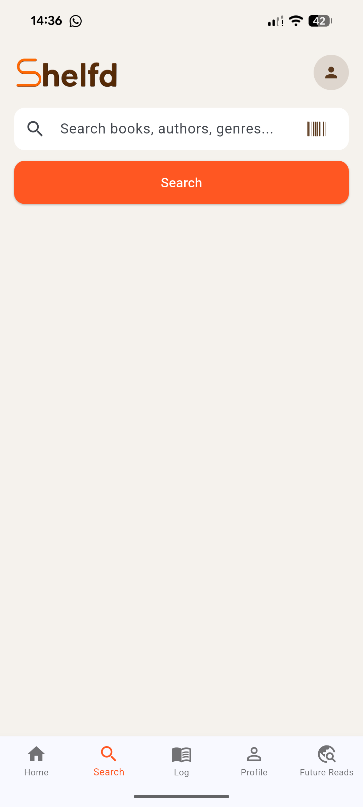
>
> 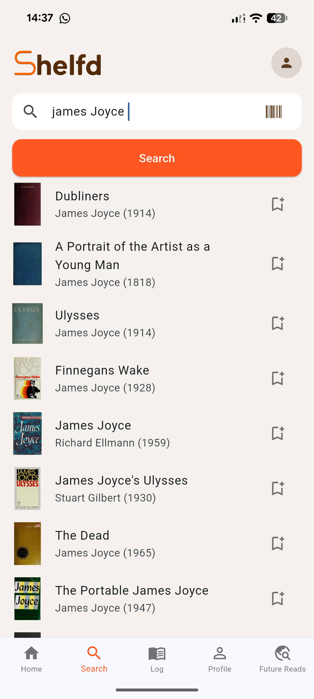
>
> Once the desired book has been found or scanned the review screen will be displayed. From here a rating and review comment can be added. The format/type of book can also be added along with and option to "favourite" a book using the star in the top right
> 
> 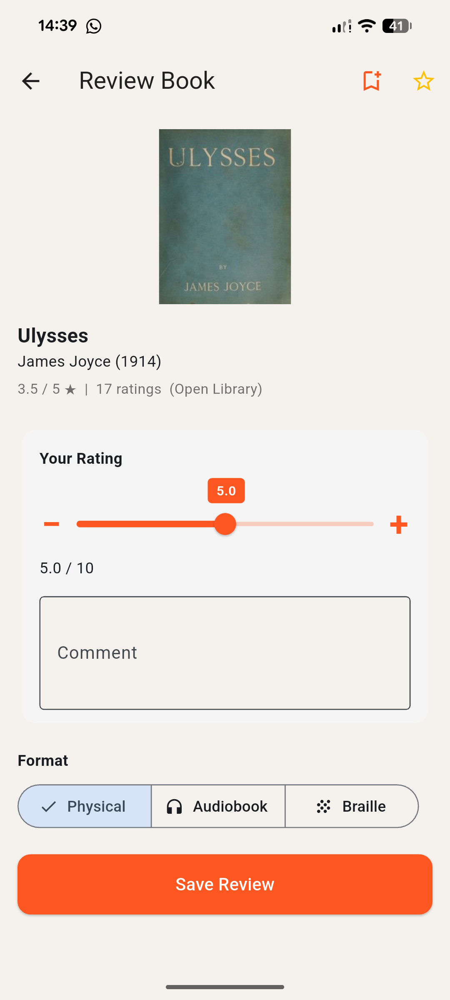
>
> After saving the review it will be visible under the Reading Log.
>
> 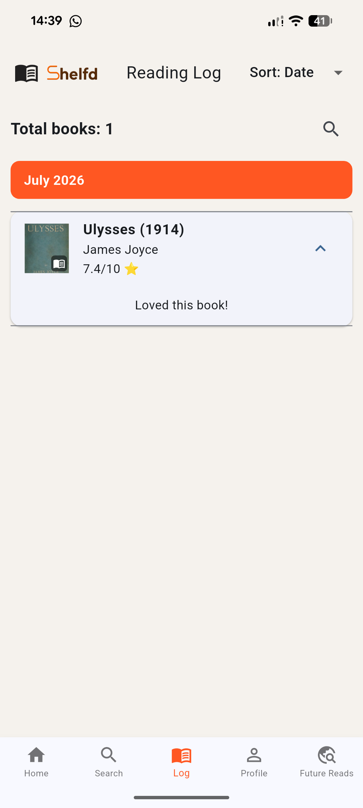
>
> It is possible to edit/remove this review once added

2. How to edit a review?

> A review can be edited once logged. This can be achieved by holding down on the logged book in the Reading Log screen.
>
> 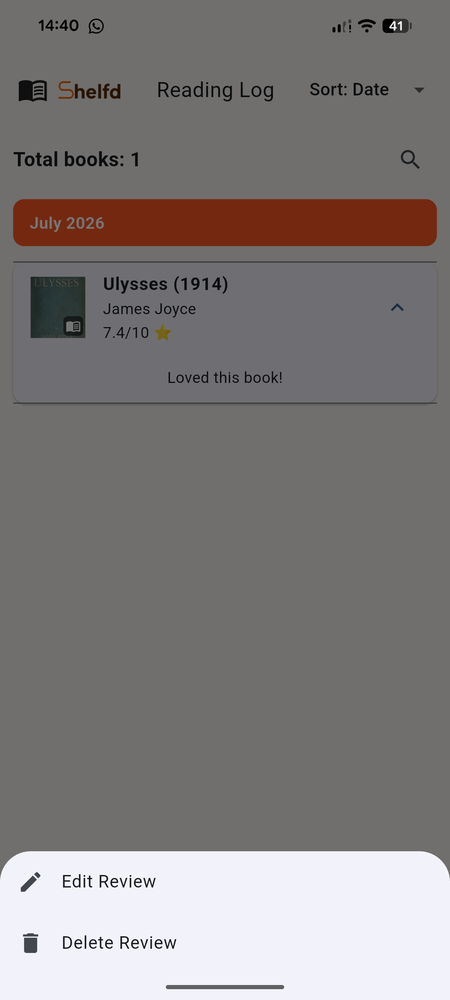
>
> *Note: This can also be achieved in the search result screen if the book has already been logged*

3. How can a book be added to the Future Reads screen?

> A book can be added to the Future Reads screen in a couple of ways. When searching for a book, each item in the returned list has a *+bookmark* symbol which can be selected to add that book to the Future Reads 
>
> 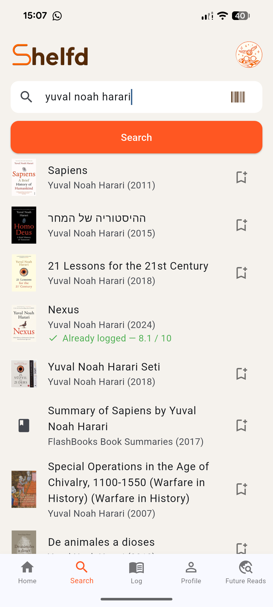
>
> It is also possible to add a book to the Future Reads sceen from the "Recommended or You" section on the Home screen. Once a book has been logged the Recommended for You section begins to populate, suggesting books based on your logged history. Any book in this list can be held down and added to the future reads.
>
> 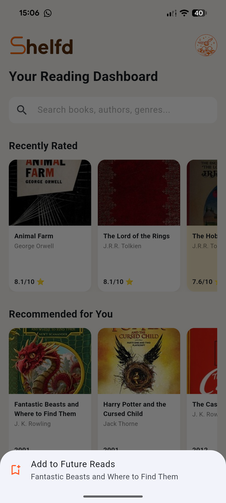
>
> Any book added to the Future Reads will appear on that screen. From here holding down will give the option to review or remove from the list
>
> 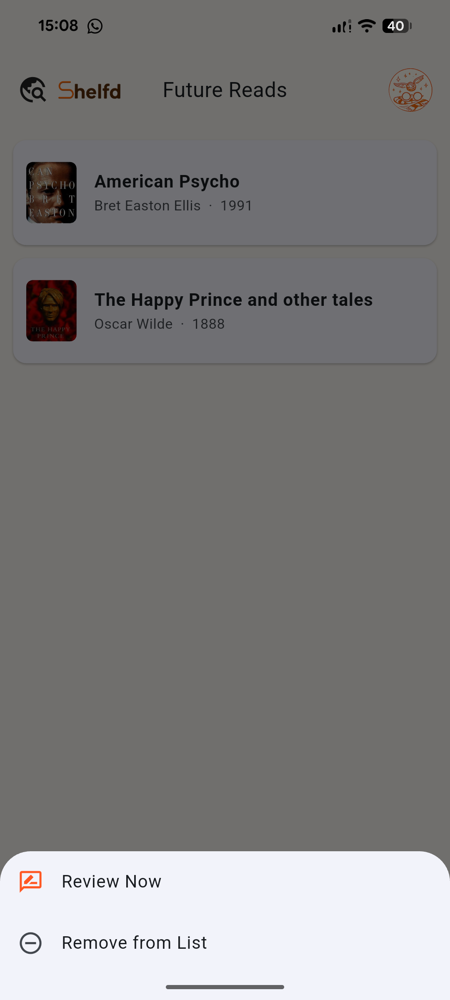

4. How can a user update the username?

> When an individual registers to Shelfd for the first time they will get assigned a randomly generated username. 
>
> 1. Navigate to the "Profile" screen
>
> 2. Select the settings cog in the top right
>
> 3. Select the edit pencil option under the Username option

5. How to add a Friend?

> A friend can be added in a couple of ways. The first is by navigating to the Profile screen and going onto the "Friends" section. Once here the username of the individual can be searched for and a request sent. *Note: the username has to be an exact match.*
>
> 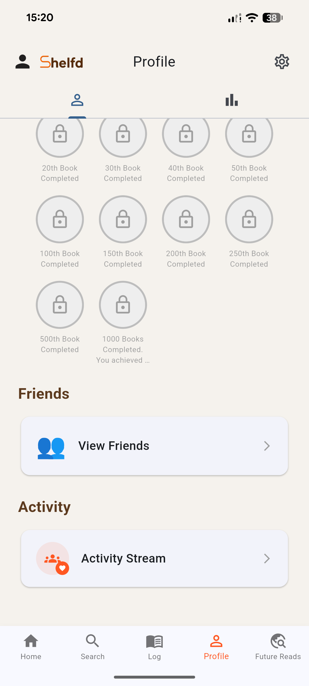
>
> 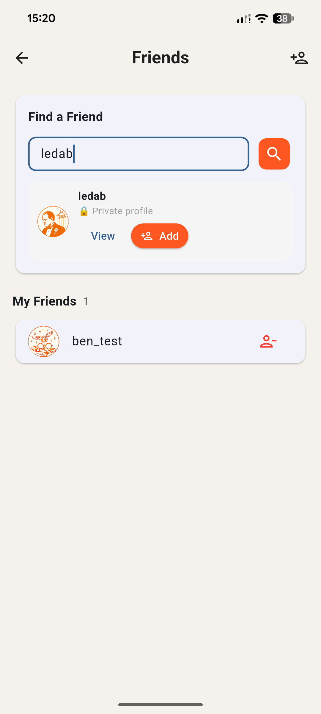
>
> The second option is by using the QR code scanner on the Profile screen on the right of the Username field. Once the QR code is selected the code is enlarged so anyone else can scan it. From here there is an option to scan someone elses code as well.
>
> 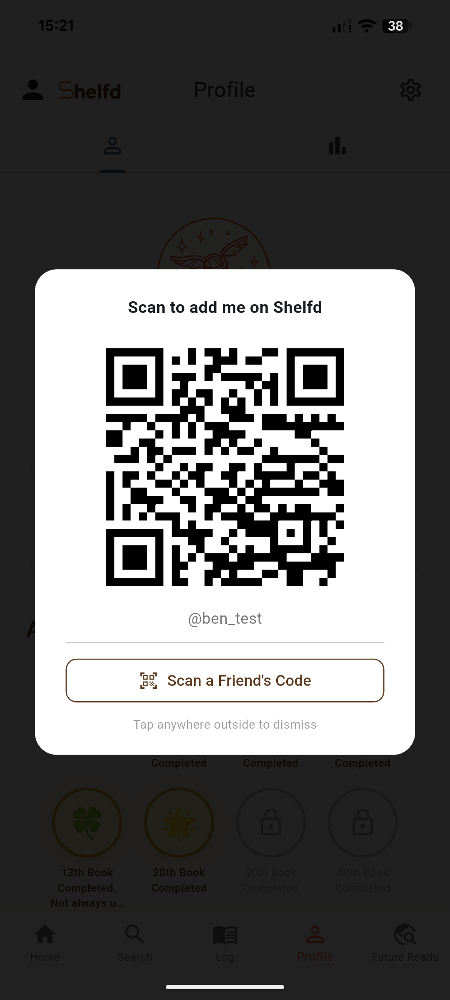

6. How to change the theme on the app?

> 1. Navigate to the "Profile" screen
>
> 2. Select the settings cog in the top right
>
> 3. Select the "Theme" option
>
> 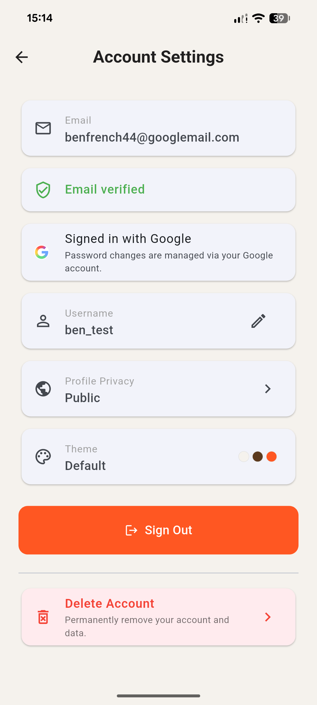

