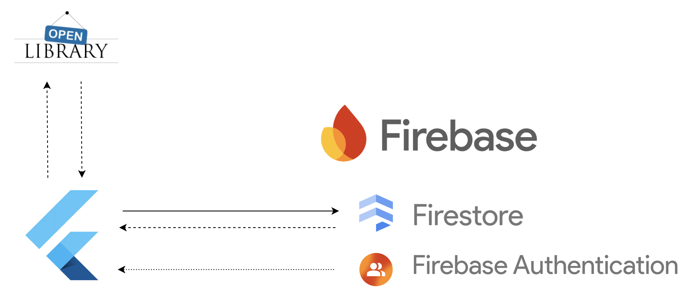
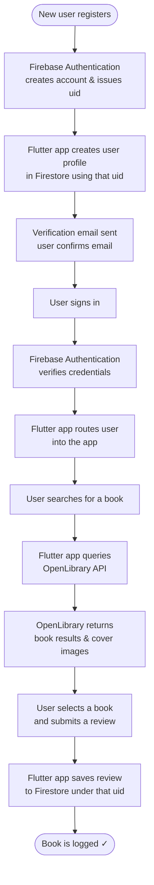

## Architecture

#### Overview Diagram

 

**Openlibrary:**
- The Openlibrary API is used purely as a read/lookup source. There is no direct interaction between Openlibrary and FireBase.
- App code acts as the middle-man to transform the information from Openlibrary and passes it to FireStore

**FireBase Authentication:**
- FireBase Authentication issues a unique ID (uid) on registration
- FireBase Authentication and FireStore do not interact directly with each other. Again, the app code acts as the middle-man passing the uid

**FireStore:**
- Any information/data associated with a user is stored in FireStore. Anytime this is updated, changed, added to, or removed FireStore is involved. Any read or write type operation.

#### New User Registration Flow

The following diagram shows the flow of a user registering and logging a book and how this interact with the major components 

